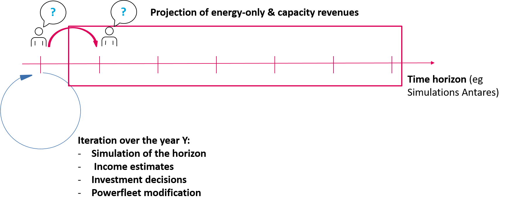
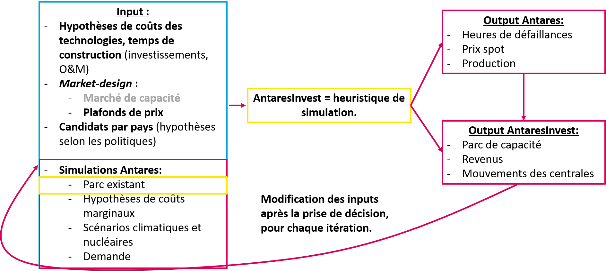
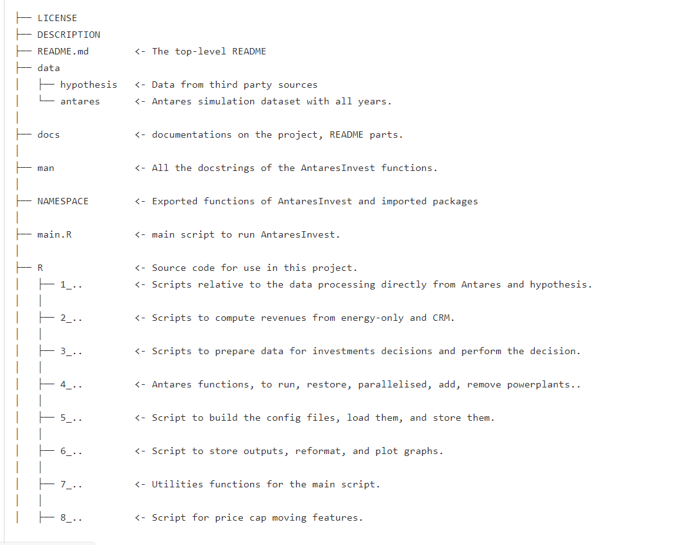
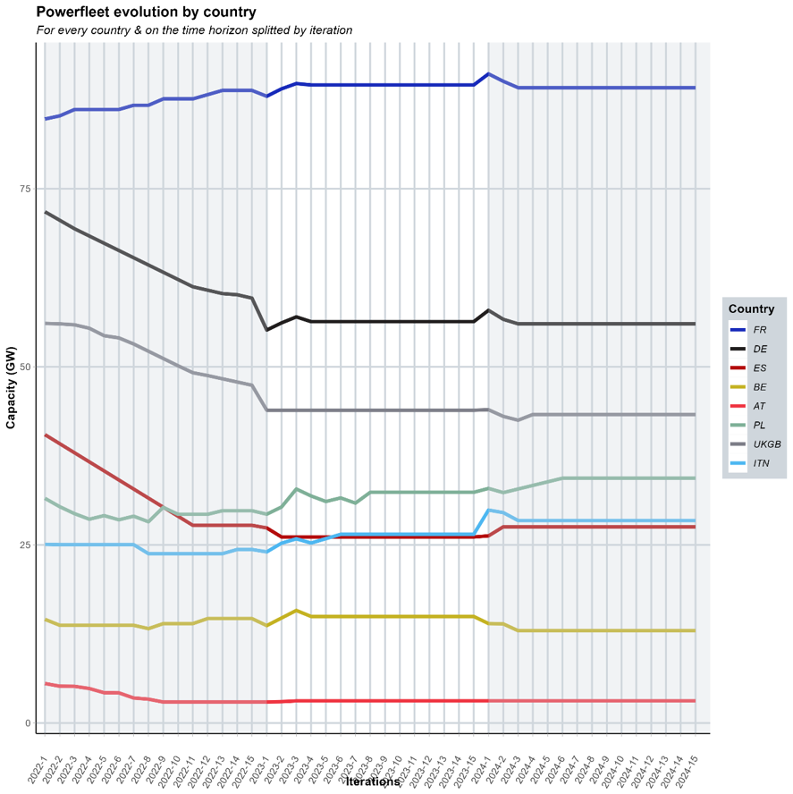
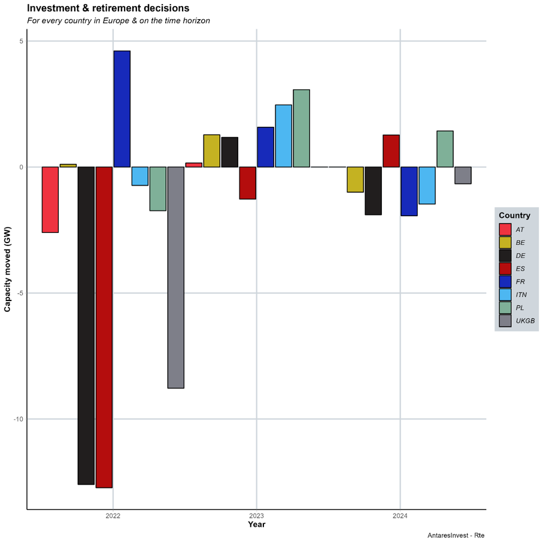

# AntaresInvest 

**AntaresInvest** is an extension of [**Antares Simulator**](https://antares-simulator.org
) optimization solution provided by [*Rte*](https://www.rte-france.com/) to model the european power system. Antares is a unit commitment tool and makes the dispatch over the EU power system  whereas AntaresInvest works as the multi-year investment simulation model. AntaresInvest computes revenues of the **energy-only** market based on Antares Simulation. Then, other market architectures are implemented such as **capacity remuneration mechanism** or **service system** for example. Investors make decisions to retire or invest based on economic assumptions and revenues computation. Powerfleet is updated based on these decisions and time moves on. Iterations over the same year are made. Powerfleet is adapted following rules implemented.

# Table of contents

1. [Architecture of the model](#architecture-of-the-model)
2. [Quick start!](docs/handson.md)
5. [Project's architecture](#projects-architecture)
6. [Parameters description](docs/parameters_description.md)
7. [Scripts description](docs/script_description.md)
8. [Data format description](docs/data_format.md)
9. [Make outputs of the model](#make-outputs-of-the-model)
10. [Interact with AntaresWeb through API](#interact-with-antaresweb-through-api)
11. [Modelling elements](docs/modelisation.md)
12. [Authors and contributions](CONTRIBUTING.md)

## Architecture of the model

| **Dynamic functioning of the model** | **Data organization & pipeline**|
|:---:|:---:|
| [](docs/picture/dynamic_functioning.png) | [](docs/picture/pipeline_data.png) |

### Investment decisions

* Investment decisions is made if following conditions are filled for a capacity *c* on year *t*:

```math
NPV = \sum_{t = 1}^{timeHorizon} \gamma (energy_{t,c} + crm_{t,c} + ss_{t,c} - OC_{c}) - IC_{c} > 0
```

* Retirement is assumed if :

```math
totalNetRevenues_{t,c} < \alpha 
```

```math
expectedNetProfit = \sum_{t = 1}^{midTermHorizon} \gamma (energy_{t,c} + crm_{t,c} + ss_{t,c} - OC_{c}) < 0 
```

* Limit of investment & retirement for each country and year :

```math
\sum_{c \in I_{y}} K_{c} < limitInvestment_{area}
```

```math
\sum_{c \in I_{y}} K_{c} < limitRetirement_{area}
```

* For adaptative power increment option, the new power increment is computed as :

```math
powerIncrement_{area,t} = powerIncrement_{area} | \frac{LOLD_{t,area} - RS_{area}}{RS_{area}} |
```

* For the 25% remaining iteration,

```math  
powerIncrement_{area,t} = min(powerIncrement_{area,t}, minIncrement)
```
where :

* *`energy`* : energy revenues
* *`crm`* : capacity remuneration mechanism revenues
* *`ss`* : service system revenues
* *`OC`* : maintenance & operational costs
* *`γ`* : discount rate
* *`α`* : threshold to consider revenues as negative
* *`IC`* : investement costs
* *`LOLD`* : Loss of load duration
* *`RS`* : Reliability standard

## Quick start

[**Here**](docs/handson.md) find examples and insights to get started with AntaresInvest.

## Project's architecture

[**Here**](docs/architecture.md) is the project's architecture :

<a href='docs/architecture.md'>

</a>

## Parameters description

The package has different parameters config yaml file. YAML is a structured text file easy to load in R and keeps the data structure. Here are the different config files :

Find here a full [**description**](docs/parameters_description.md).

## Scripts description

Find here a full [**description**](docs/script_description.md).

## Data format description

In the model, the data format mainly used to keep data organised and tracked are the R lists (eg. dictionnaries for *Python* addict). There are 5 main variables to do so.

Find here a full [**description**](docs/data_format.md).

## Make outputs of the model

[**Here**](docs/outputs.md) find examples of how to complete `make_outputs()` functions. To build such graphics and output excel files : 

<p float="left">
  
   
</p>

## Interact with AntaresWeb through API

[**Here**](docs/api.md) find examples to get to know how to handle API of [**AntaresWeb**](https://antares-web.rte-france.com/) with **R**.

## Modelling elements

[**Here**](docs/modelisation.md) find modelling choices.

## Contributions & contributors

AntaresInvest is licensed under the open source [MIT License](LICENSE.md).

Copyright 2022 - Now [**Rte - AntaresInvest developpers**](AUTHORS.md).

To contribute, follow the [**guidelines**](CONTRIBUTING.md).
