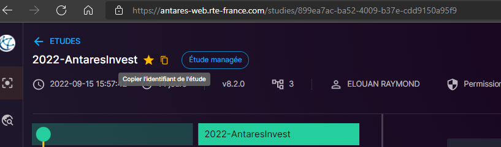

# AntaresWeb API 

> Sometimes, you will be in situation where you need to access a specific features of antares in antates web meanwhile this feature is not supported in the libraries antaresEdiObject of antaresRead.
To do so, you will have to access to the documentation of antares web api : <https://antares-web.rte-france.com/apidoc> <br/>
You can reproduce any API requests with httr, jsonlite and your api token.

### Get your token

You can get your token going into the `Settings`. Then on the right on side, click on `Create` button and follow the guidelines to create your own token. 


### The type of API request

* GET: a get request is used to retrieve information from the API
* POST: a post request is used to set data on the server, the data is in the body of the request
* PUT: a put request is used to update data on the server, the data is in the body of the request
* DELETE: a delete request is used to delete data on the server

#### Doing a GET Request

> Assuming you need to get all the variants of a study. You need to get the study_id of your antares study from antares web. To do so, you go on the study page and you can copy to clipboard the study_id. Also note that the study_id is on the url.


* We are going to use the method "get study variants" that you can find in apidoc => Manage Study Variant.

```R
  study_id = "899ea7ac-ba52-4009-b37e-cdd9150a95f9" # The study_id of interest
  host = "https://antares-web.rte-france.com/api" # The host url
  url = glue::glue("{host}/v1/studies/{study_id}/variants") # The whole url of the method.
  g = httr::GET(url, ## We send a GET request to the url 
                httr::add_headers(Authorization = paste("Bearer", token, sep = " ")) # The headers help us to authorize our request with our token. 
                )
  ### Know if the request was successfull
  #### If status_code == 200, the request was successfull else we had an issue
  if (g$status_code == 200){
    print("Request was successfull")
  } else {
    print(glue::glue("Failed to GET {url}"))
  }
  ### We need to access to the content of g (if request was successfull)
  g_content = httr::content(g) ## generally a list (a json converted to a list)
```

<br/>

#### Doing a POST Request

> Now, we want to edit the unit count of a clusters in an antares web simulation, thanks to a POST request.

```R
  study_id = "899ea7ac-ba52-4009-b37e-cdd9150a95f9" # The study_id of interest
  host = "https://antares-web.rte-france.com/api" # The host url
  prev_cluster_name = cluster_name # The original cluster name of our API
  cluster_name = cluster_name %>% gsub(" ","%20",.) # we replace space by "%20" to fill API url
  url = glue::glue("{host}/v1/studies/{study_id}/raw?path=input/thermal/clusters/{area}/list/{cluster_name}/unitcount") ## The url we want to edit
  p = httr::POST(url, # The url
                 httr::add_headers(Authorization = paste("Bearer", token, sep = " ")), # Authorization headers
                 body=as.character(unitcount) # The body, the new unit count
                 )
  if(p$status_code == 204){
    ### We can extract the status code of the request, for a successfull POST request, status_code is 204
    print(glue::glue("\n=> Successfully edited {prev_cluster_name}, with new UC: {unitcount}"))
  } else {
    print(glue::glue("\n=> !!!! FAILED !!!! at editing {prev_cluster_name} for {study_id}"))
  }
```

<br/>

#### Doing a PUT Request

> Now, we want to multiply the existing time series of a cluster. To do so we use a method that you can find Manage Study Data / edit matrix. This method enable to add a constant, multiply the time series (or subset) or even set a value

```R
  prev_cluster_name = cluster_name
  cluster_name = cluster_name %>% gsub(" ","%20",.) # we replace space by "%20" to fill API url
  operation = "*" # We multiply
  value = 1.1 # We multiply by 1.1
  ### We have to build the body and convert it to JSON.
  ### To do so we build it with lists
  ### list() %>% jsonlite::toJSON(.) => "[]"
  ### list("a"="b") %>% jsonlite::toJSON(.) => "{'a':'b'}"

  body = list(list(slices = list( list(row_from=0, # We want to edit the whole matrix 
                                       row_to = 8759,
                                       column_from = 0, # All the columns of the time series
                                       column_to = 1000) ),
                   operation = list( operation= operation,
                                     value= value )  )) %>% jsonlite::toJSON(.,auto_unbox=T,pretty=T)
  ### The URL for the PUT request
  url = glue::glue("{host}/v1/studies/{study_id}/matrix?path=input/thermal/series/{area}/{cluster_name}/series")
  p = httr::PUT(url, 
                httr::add_headers(Authorization = paste("Bearer", token, sep = " ")),
                body=body)
  operations = list("="="Set value to",
                    "*"="Multiplied by",
                    "+"= "Added")
  if(p$status_code==200){
    ### Verbose based on the status code of the request
    print(glue::glue("\n=> Successfully edited {prev_cluster_name} timeseries - {operations[[operation]]} {value}"))
  } else {
    print(glue::glue("\n=> !!!! FAILED !!!! at editing {prev_cluster_name} for {study_id}"))
  }
```

##### Doing a DELETE Request

> Finally, we can send a DELETE request to delete data stored on server. It is mainly used to delete a study variant.

```R
  ### We use the same host as before. For the study_id it has to be a the study_id of a VARIANT. DO NOT DELETE the reference study.
  url = glue::glue("{host}/v1/studies/{study_id}")
  del = httr::DELETE(url, httr::add_headers(Authorization = paste("Bearer", token, sep = " "))) ## We add authorization headers & set the url
  if(del$status_code==200){
    ### Verbose handling the statud code of our request.
    ### year & variant_name are defined in the args of the function delete_study_antares_web (cf. antares_web_utils.R)
    print(glue::glue("\n=> Successfully deleted variant [{variant_name}] from [{year}]"))
  } else {
    print(glue::glue("\n!! FAILED !! at deleted study [{study_id}] ({variant_name} of {year})"))
  }

```

<br/>